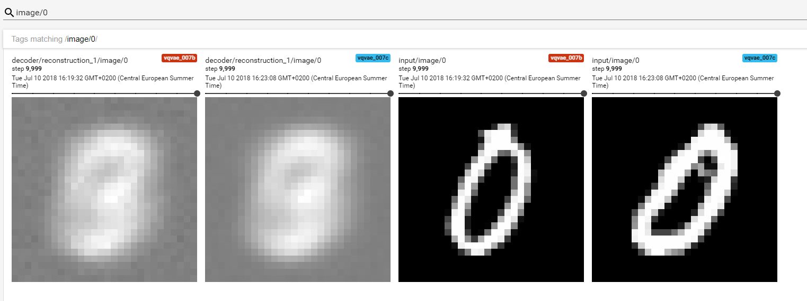
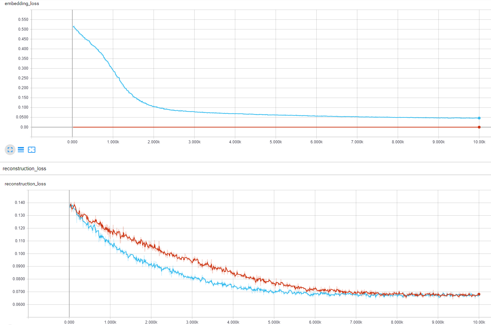

# VQ-VAE Implementation
Attempt to implement a VQ-VAE ([paper](https://arxiv.org/abs/1711.00937)) in TensorFlow. The training has not converged and the autoencoder does not work well, so far (as can be seen in the image below).

Interesting aspects are the implementation of the gradient that skips the embedding lookup layer and the embedding lookup itself:
```python
embedding_space = tf.get_variable(name='space', shape=[EMBEDDING_COUNT, CODE_SIZE], initializer=tf.random_normal_initializer)
embedding_space_batch = tf.reshape(tf.tile(embedding_space, [BATCH_SIZE, 1]), [BATCH_SIZE, EMBEDDING_COUNT, CODE_SIZE])
encoder_tiled = tf.reshape(tf.tile(encoder_out, [1, EMBEDDING_COUNT]), [BATCH_SIZE, EMBEDDING_COUNT, CODE_SIZE])
differences = tf.subtract(embedding_space_batch, encoder_tiled)
l2_distances = tf.reduce_sum(tf.square(differences), axis=2, name='l2_distances')
e_index = tf.argmin(l2_distances, axis=1, name='e_index')
code = tf.gather(embedding_space, e_index, axis=0, name='lookup_result')
code_stop_grad = tf.stop_gradient(code - encoder_out) + encoder_out
```

  
_Fig 1. The reconstruction was not working. Also it appeared that exactly the same embedding vector was chosen, every time._


_Fig 2. Loss on embeddings (top) and the autoencoder reconstruction error (bottom)._